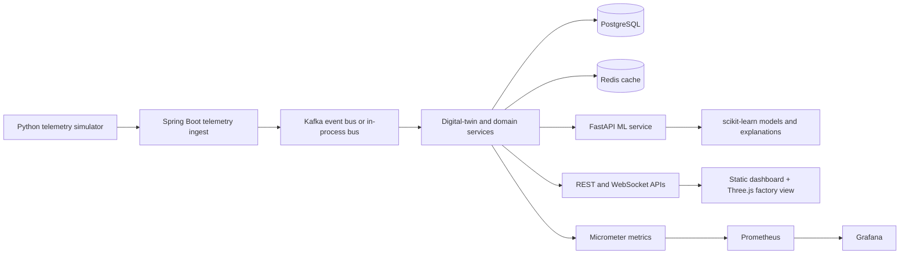

# ForgeSense Industrial Intelligence

ForgeSense is a portfolio-scale industrial operations platform that turns simulated machine telemetry into a searchable fleet view, digital-twin state, anomaly/failure-risk assessments, maintenance workflows, alerts, production-impact analysis, and operator-facing visualizations.

The repository is deliberately explicit about its boundaries: the simulator and fleet profiles are synthetic, the ML service trains on those profiles, and the system is a reproducible engineering project rather than a production deployment.

## System overview



The Docker Compose topology also provisions Kafka, PostgreSQL, Redis, the ML service, the telemetry simulator, the frontend, Prometheus, and Grafana. The backend can use an in-process event bus for development and Kafka for the Compose profile.

## Key capabilities

- Telemetry ingestion and normalization, including batch ingestion.
- Machine and factory/zone views backed by PostgreSQL/JPA repositories.
- Digital-twin state and connectivity monitoring for machines.
- Kafka-backed event flow with an in-process development alternative.
- ML assessments from FastAPI/scikit-learn: anomaly label/score, failure risk, heuristic RUL estimate, factors, and recommendations.
- Maintenance scheduling, lifecycle actions, alerts, production-impact analysis, and simulation controls.
- JWT login, role-aware backend security, WebSocket notifications, Actuator health, Prometheus metrics, and OpenAPI UI.
- Static frontend with a Three.js factory floor, fleet/detail views, analytics, prediction, maintenance, simulation, alert, and event screens.

## Technology stack

| Area | Technologies present in the repository |
| --- | --- |
| Backend | Java 25, Spring Boot 4.1.1, Spring MVC, Spring Data JPA, Spring Security, WebSocket, Actuator |
| Data and messaging | PostgreSQL, H2 development runtime, Redis, Apache Kafka |
| ML service | Python, FastAPI, NumPy, pandas, scikit-learn, joblib, pytest |
| Frontend | HTML/CSS/JavaScript, Three.js via CDN, Python static server |
| Operations | Docker Compose, Prometheus, Grafana, health checks, Micrometer |

## Run with Docker Compose

Prerequisites: Docker Desktop with Compose support.

Create a local environment file from the committed placeholder template and replace the development values before sharing or deploying the stack:

```bash
cp .env.example .env             # Linux/macOS
Copy-Item .env.example .env      # PowerShell
```

At minimum, set `FORGESENSE_DEV_PASSWORD` and `FORGESENSE_SECURITY_JWT_SECRET` in `.env`. Use a strong, unique JWT secret outside local development. Then run:

```bash
docker compose up --build
```

Useful local URLs:

| Service | URL |
| --- | --- |
| Frontend | `http://localhost:5173` |
| Backend API | `http://localhost:8080` |
| Backend OpenAPI UI | `http://localhost:8080/swagger-ui/index.html` |
| ML health | `http://localhost:8001/health` |
| Prometheus | `http://localhost:9090` |
| Grafana | `http://localhost:3000` |

The Compose file is the source of truth for ports and service names.

## Local development

Run the services separately when iterating on one layer:

```bash
# Backend
cd backend
./mvnw spring-boot:run -Dspring-boot.run.profiles=dev

# ML service, from the repository root after installing ml-service/requirements.txt
uvicorn app.main:app --app-dir ml-service --host 0.0.0.0 --port 8001

# Frontend, from the repository root
python frontend/serve.py

# Optional telemetry feed, from the repository root
python simulator/telemetry_feed.py --degrade M-105
```

The development profile uses H2 and the in-process event bus; the Compose profile wires the backend to PostgreSQL, Redis, Kafka, and the ML container.

## API surface

The backend controllers expose versioned endpoints under `/api/v1`. Representative groups are:

| Group | Examples |
| --- | --- |
| Authentication | `POST /api/v1/auth/login` |
| Machines | `GET /api/v1/machines`, `GET /api/v1/machines/{machineId}/telemetry`, `GET /api/v1/machines/{machineId}/predictions` |
| Telemetry | `POST /api/v1/telemetry/ingest`, `POST /api/v1/telemetry/ingest/batch` |
| Analytics | `GET /api/v1/analytics/overview`, `/risk-ranking`, `/alerts`, `/health-trends` |
| Maintenance | `GET /api/v1/maintenance`, `POST /api/v1/maintenance/{id}/schedule` |
| Alerts and events | `/api/v1/alerts`, `/api/v1/events` |
| Simulation | `/api/v1/simulation/scenarios`, `/api/v1/simulation/run`, `/api/v1/simulation/control` |
| Operations | `/actuator/health`, `/actuator/prometheus`, and the OpenAPI UI |

The controller classes under `backend/src/main/java/com/forgesense/**/web/` are the authoritative endpoint reference.

## Machine-learning workflow

1. The ML service loads the machine profile catalog and builds deterministic training data.
2. It trains or loads an `IsolationForest` anomaly model and a `GradientBoosting` failure-risk model.
3. `POST /assess` converts telemetry into the feature vector for the machine type.
4. The response includes anomaly score/label, failure risk, a heuristic RUL estimate, missing sensors, factors, and recommendations.
5. The Spring Boot prediction service consumes the assessment and stores/publishes the result for the dashboard.

The repository also stores evaluation metadata under `ml-service/models/`; these are project artifacts, not a claim of production model accuracy.

## Verification

```bash
# Backend tests
cd backend
./mvnw test

# ML tests
cd ../ml-service
python -m pytest

# Python syntax checks
cd ..
python -m py_compile frontend/serve.py simulator/telemetry_feed.py

# Frontend checks used by the repository CI
cd frontend
for f in js/*.js js/views/*.js; do node --check "$f"; done
node --test test/util.test.mjs
```

The exact CI workflow is in [`.github/workflows/ci.yml`](.github/workflows/ci.yml); it also packages the backend, boots it with the development profile, trains the ML bundle, and probes the factory endpoint.

## Project structure

```text
backend/       Spring Boot domain, API, persistence, security, streaming, and tests
ml-service/    FastAPI schemas, feature extraction, model lifecycle, explanations, and tests
simulator/     Synthetic telemetry producer and machine profiles
frontend/      Static dashboard, Three.js scene, API client, and views
config/        Machine profile catalog
infra/         Prometheus and Grafana provisioning
docs/          Architecture, data flow, deployment, ownership, and system design
```

## Engineering notes and current limits

- Redis, Kafka, PostgreSQL, and the ML service are real integration points in the Compose topology; local development deliberately supports lighter in-process/H2 alternatives.
- The ML RUL value is explicitly documented in code as a heuristic mapping, not a calibrated remaining-useful-life measurement.
- The simulator uses synthetic telemetry and the repository does not claim industrial production data or deployment scale.
- Before any shared deployment, replace all development credentials and review CORS, Actuator exposure, and container defaults.

## Documentation

- [Architecture](docs/ARCHITECTURE.md)
- [Data flow](docs/DATA_FLOW.md)
- [System design](docs/SYSTEM_DESIGN.md)
- [Deployment](docs/DEPLOYMENT.md)
- [Project specification](docs/PROJECT_SPECIFICATION.md)

## License and author

Released under the [MIT License](LICENSE).

**Karkala Shiva Reddy** — [GitHub](https://github.com/karkalashivareddy)
