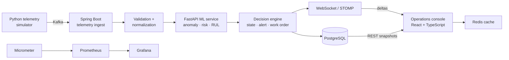

# ForgeSense Industrial Intelligence

> **Real-time industrial asset intelligence platform for monitoring machine health,
> detecting anomalies, predicting failure risk, and coordinating maintenance
> workflows.**

ForgeSense turns a synthetic telemetry stream into a working industrial
operations console: a digital twin of the plant, live asset health, explainable
predictions, an alert lifecycle, a maintenance workflow, a what-if scenario
laboratory, and a platform observability surface.

> ### ⚠ This is a synthetic system
>
> All telemetry is generated by a simulator in this repository, and the ML
> models were trained on data that same simulator produced. **Nothing here
> monitors, represents, or controls any physical machine.** The console states
> this in the sign-in gate, the status strip, and every workspace that could be
> misread.

---

## The problem

Industrial operations teams have real telemetry, and almost nothing they can
trust. Dashboards go stale without saying so. An "online" badge reflects a
connection, not a condition. A risk score arrives with no way to ask *why*. An
alert fires and then vanishes, because the next poll overwrote it. Nobody can
say, at 03:00, whether the screen in front of them is showing fresh data or a
frozen snapshot from four minutes ago.

The cost is not the data. It is the inability to distinguish **observed** from
**inferred**, **fresh** from **stale**, and **a model estimate** from
**a measurement**.

## The solution

ForgeSense is built around one idea: **the interface must tell you how much to
trust it.**

- Every meaningful number carries a **data basis** — observed, derived,
  model-predicted, synthetic, simulated, or unavailable.
- The connection indicator says `SYNTHETIC · simulator feed`, never `LIVE`,
  because a configured transport is not a healthy transport and a simulator is
  not a factory.
- Remaining-useful-life is shown in **simulator degradation steps** — never
  hours — because the backend contract defines no time unit. There is no
  hours formatter in the codebase, and a test enforces it.
- A `0.06%` failure risk renders as `0.06%`, never `0%`.
- Attribution is labelled **baseline perturbation**, never "SHAP", because no
  SHAP library is involved.
- When the ML service is down, predictions are labelled `HEURISTIC FALLBACK` and
  the Predictions banner says how many assets are affected.

Everything else follows from that discipline.

---

## Architecture


```mermaid
flowchart LR
    S[Python telemetry<br/>simulator] -->|Kafka| I[Spring Boot<br/>telemetry ingest]
    I --> V[Validation +<br/>normalization]
    V --> M[FastAPI ML service<br/>anomaly · risk · RUL]
    M --> D[Decision engine<br/>state · alert · work order]
    D --> DB[(PostgreSQL)]
    D --> WS[WebSocket / STOMP]
    WS -->|deltas| C[Operations console<br/>React + TypeScript]
    DB -->|REST snapshots| C
    C --> R[Redis cache]
    O[Micrometer] --> P[Prometheus] --> G[Grafana]
```

| Layer | Technology |
| --- | --- |
| Frontend | React 18 · TypeScript 5.7 · Vite 6 · TanStack Query · Zustand · Three.js · ECharts |
| Backend | Java 25 · Spring Boot 4 · Spring Security (JWT + RBAC) · WebSocket/STOMP |
| Data | PostgreSQL · Redis · Kafka · H2 (dev) |
| ML | Python · FastAPI · scikit-learn · IsolationForest + GradientBoosting |
| Ops | Docker Compose · Prometheus · Grafana · nginx |

---

## Data flow

```
simulator → Kafka → validation → normalization → ML assessment → decision engine
                                                              ↓
                                            state change · alert · work order
                                                              ↓
                                    PostgreSQL (authority) + STOMP deltas
                                                              ↓
                     REST snapshot reconciliation ◀── console ◀── realtime deltas
```

**REST is the authority; realtime is a latency optimisation.** A sequence gap
or a reconnect triggers a REST re-seat, so the client can never drift away from
the system of record. See
[`docs/REALTIME_FRONTEND_CONTRACT.md`](docs/REALTIME_FRONTEND_CONTRACT.md).

---

## The console

| Workspace | Question it answers |
| --- | --- |
| **Command Center** | What is happening in the factory, right now? |
| **Factory Twin** | Where is it, spatially — and what does it depend on? |
| **Fleet** | Every asset, filterable and sortable. |
| **Telemetry** | What are the sensors actually reading, and how fresh? |
| **Predictions** | Why is the model worried, and how much should I trust it? |
| **Anomalies** | Which signals are outside the modelled envelope? |
| **Analytics** | Fleet distribution, risk ranking, operational counts. |
| **Alerts** | The full lifecycle, with the actions your role permits. |
| **Maintenance** | The work-order board, mirroring the backend contract exactly. |
| **Event Stream** | What happened, and when. |
| **Scenario Lab** | What would break if… — with no physical control, stated loudly. |
| **System** | What is broken, what still works, what can I trust. |

**Digital twin** — Three.js, on-demand rendering (a stationary scene costs no
GPU), with three encoding modes: status, predicted risk, and dependency
propagation. Every machine is also reachable from the asset list, the fleet
table and `Ctrl+K`, so the 3D view is an enhancement, never a gate.

**Differentiators** — a data-trust indicator on every view; an explainability
bridge from a prediction driver to the telemetry it came from; a
risk → alert → investigation → maintenance flow; selection shared across every
workspace; and a scenario replay timeline.

---

## Run it

```bash
cp .env.example .env     # PowerShell: Copy-Item .env.example .env
# Set POSTGRES_PASSWORD and FORGESENSE_SECURITY_JWT_SECRET in .env.
docker compose up --build -d
```

| Service | URL |
| --- | --- |
| **Console** | http://localhost:5173 |
| Backend / OpenAPI | http://localhost:8080 · /swagger-ui/index.html |
| ML health | http://localhost:8001/health |
| Prometheus · Grafana | http://localhost:9090 · http://localhost:3000 |

Sign in with `admin` / `forgesense-dev`.

Full instructions, including local development and troubleshooting:
[`docs/OPERATIONS_RUNBOOK.md`](docs/OPERATIONS_RUNBOOK.md).

---

## Verify it

```bash
cd frontend
npm ci
npm run typecheck   # strict TypeScript, including tests
npm test            # 66 unit tests
npm run e2e         # 43 Playwright browser tests
```

Browser tests assert, on every route: zero console errors, zero uncaught
exceptions, zero failed requests, zero unexpected 404s, and no horizontal
overflow at 375 / 768 / 1024 / 1440 / 1920.

---

## Documentation

| Document | Contents |
| --- | --- |
| [Architecture](docs/ARCHITECTURE.md) | System topology and layering |
| [Frontend architecture](docs/FRONTEND_ARCHITECTURE.md) | State split, realtime pipeline, twin performance model, security trade-offs |
| [API contract](docs/API_FRONTEND_CONTRACT.md) | Every endpoint, with verified units, enums and error semantics |
| [Realtime contract](docs/REALTIME_FRONTEND_CONTRACT.md) | Topics, envelope, validation, batching, failure matrix |
| [Design system](docs/DESIGN_SYSTEM.md) | Tokens, components, data-basis vocabulary |
| [UI/UX guide](docs/UI_UX_GUIDE.md) | Layout reasoning and interaction patterns |
| [Model & UI provenance](docs/MODEL_UI_PROVENANCE.md) | What each number is, and what it is not |
| [Testing](docs/TESTING.md) | Test strategy, coverage, and what is not covered |
| [Runbook](docs/OPERATIONS_RUNBOOK.md) | Run, verify, troubleshoot |
| [Known limitations](docs/KNOWN_LIMITATIONS.md) | Stated plainly, including the uncomfortable ones |
| [Future scope](docs/FUTURE_SCOPE.md) | Extension points — implemented / partial / planned |
| [Redesign report](docs/audit/FINAL_FRONTEND_REDESIGN_REPORT.md) | The full before/after audit |

Superseded design documents are preserved in
[`docs/archive/`](docs/archive/README.md) as historical evidence. **Current code
and current tests take precedence over them.**

---

## Limitations

Stated up front, in full at
[`docs/KNOWN_LIMITATIONS.md`](docs/KNOWN_LIMITATIONS.md):

- The telemetry is **synthetic**, and the models were trained on it.
- Failure risk is a **bare probability** with no confidence interval.
- Remaining-useful-life is a **simulator-relative step count**, not a
  calibrated RUL.
- Production efficiency and downtime risk are **modelled**, not measured.
- `/analytics/health-trends` returns a **snapshot, not a time series**, despite
  the name — so the console renders a distribution rather than inventing a
  trend line.
- The maintenance lifecycle is the backend's five states, not a full CMMS
  workflow. The UI does not pretend otherwise.

---

## License

MIT — see [LICENSE](LICENSE).

**Karkala Shiva Reddy** — [GitHub](https://github.com/karkalashivareddy)
