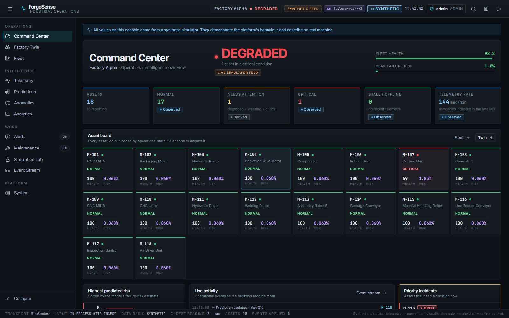
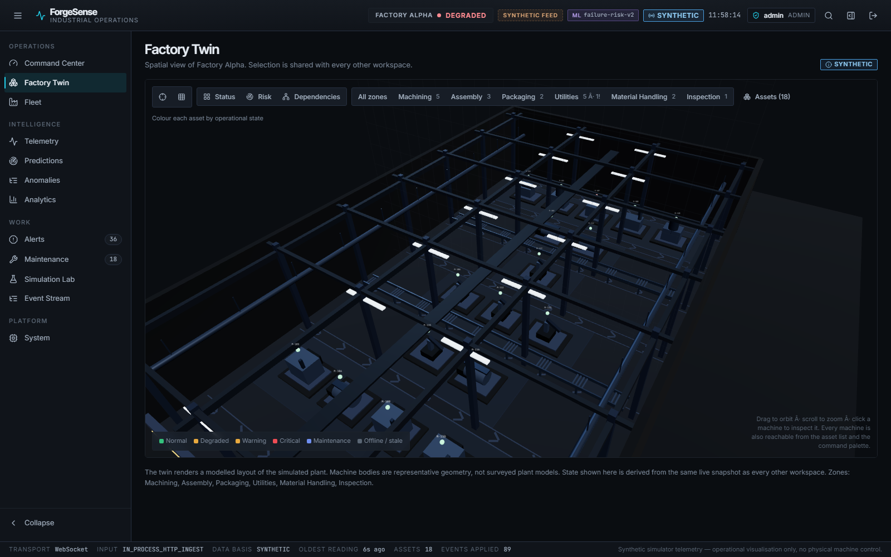
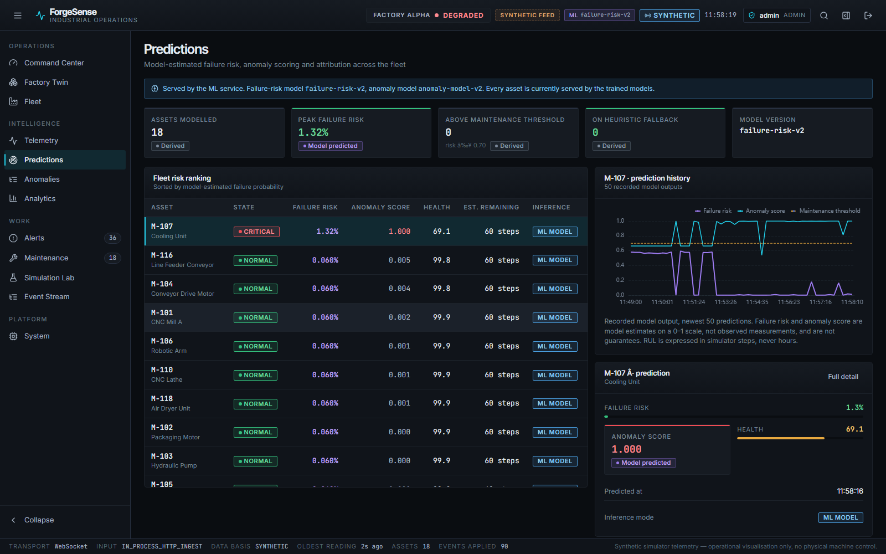
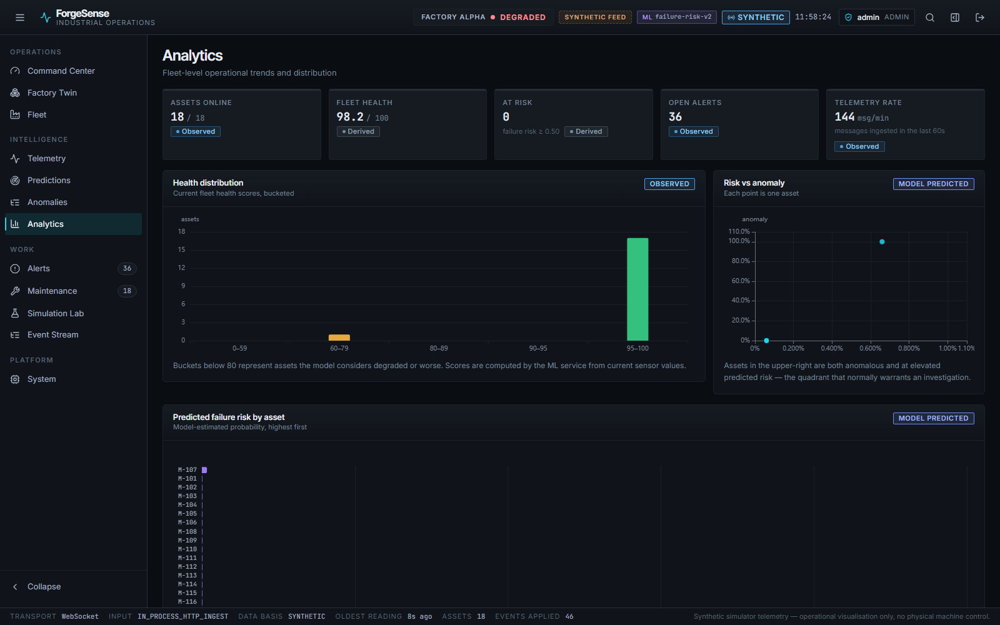
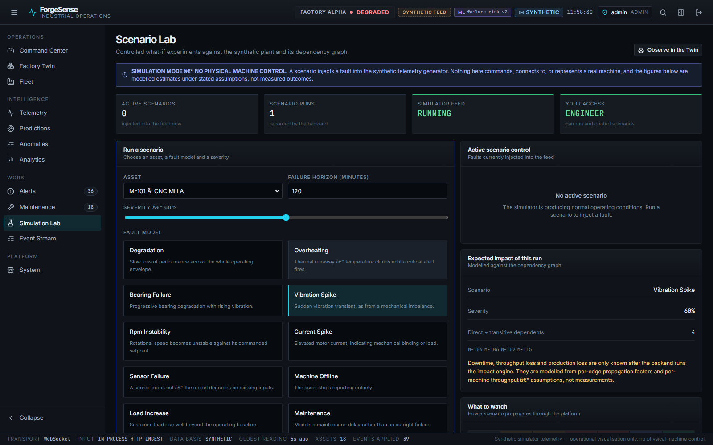
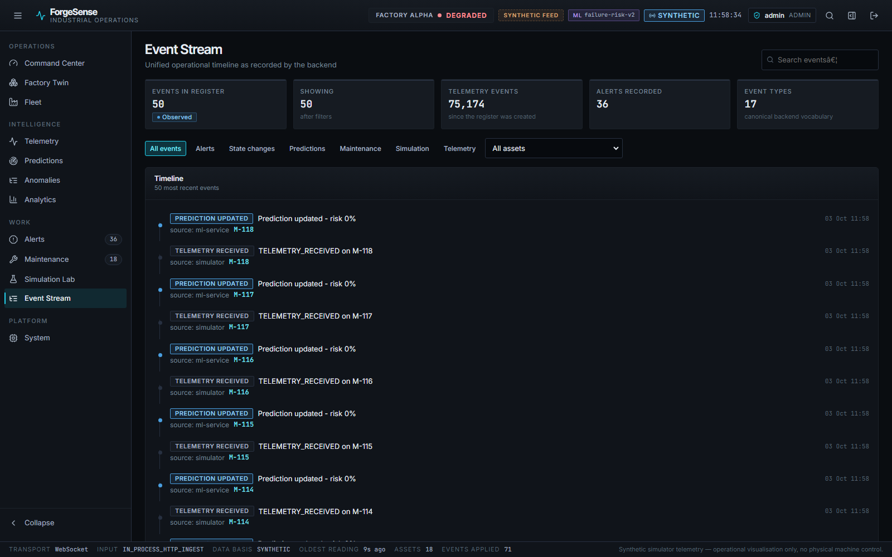

<div align="center">

# ForgeSense Industrial Intelligence

**A simulated industrial operations console: simulator-generated telemetry,
model-based assessments, and an interactive 3D factory digital twin.**

React 18 · TypeScript · Spring Boot 4 · FastAPI · STOMP/WebSocket · Three.js · scikit-learn

[](https://github.com/karkalashivareddy/forgesense-industrial-intelligence/actions/workflows/ci.yml)
[](LICENSE)

</div>

---

## Data & ML validity boundary

**Every telemetry value and model training sample is synthetic.** The
repository's generator creates the data used to train and evaluate the models:

```text
simulator and machine profiles
  → generated synthetic telemetry and training samples
    → held-out synthetic evaluation
      → inference on simulator-generated telemetry
```

Previous metric values used a random row split and are withdrawn because rows
from the same synthetic machine trajectory could appear in both partitions.
Training now evaluates on a deterministic 20% group holdout of complete
synthetic machine trajectories and records ROC AUC, PR AUC, thresholded
precision/recall/F1, confusion matrix, class balance, a majority-class baseline,
RUL MAE/RMSE in simulator steps, and held-out group/sample counts. The latest
generated evaluation was on 2026-10-09 using 8 held-out trajectories (7,200
rows, 926 failure-risk positives; 12.86%):

| Evaluation | Result | Interpretation |
|---|---:|---|
| Anomaly ROC AUC / PR AUC | 0.9037 / 0.8729 | threshold 0.009576; precision 0.8654, recall 0.7466; 26.19% anomaly prevalence |
| Failure-risk ROC AUC / PR AUC | 0.9976 / 0.9843 | threshold 0.5; precision 0.9190, recall 0.9309, F1 0.9249; Brier 0.013485 |
| Failure-risk accuracy | 0.9806 | majority-class baseline 0.8714; confusion matrix `[[6198, 76], [64, 862]]` |
| RUL MAE / RMSE | 10.163 / 13.603 steps | failure-risk-positive held-out samples |

These are results on generated held-out machines only. Even a valid held-out
synthetic result does **not** establish real-world industrial predictive
validity.
The models were trained on synthetic simulator data, no real plant telemetry
or failure history is included, and the system does not control physical
machines.

The model artifacts and evaluation report are generated rather than committed;
see [docs/ML_PROVENANCE.md](docs/ML_PROVENANCE.md) for the current method and
reproduction command.

For a production deployment, this project would still need a real OPC UA or
MQTT ingestion path with source provenance, identity through an OIDC/SAML
provider, time-series storage, a model registry and drift monitoring, real
failure data, and RUL calibration against measured outcomes. These are future
requirements, not implemented features.

## What this is

ForgeSense is an industrial intelligence console for maintenance and reliability
teams. It consolidates condition monitoring, anomaly detection, failure-risk
estimation and attribution into a single operator workspace, anchored to a
spatial model of the plant so a system-level picture and a single-sensor reading
are one click apart.

The workflow is built around triage: rank by risk, open the driver, read the
sensor, decide.

## What it deliberately does not do

This is the most important section in this README.

- **It does not connect to equipment.** There is no OPC-UA client, no MQTT
  client, and no fieldbus driver anywhere in the codebase.
- **It cannot control machinery.** No write path exists to any device. The
  simulation layer injects faults into a synthetic feed; it does not actuate
  anything.
- **It is not synchronized with a real plant.** The digital twin is a
  visualization of simulated state, not a live model of physical equipment.
  There is no PLC, SCADA, MES or historian integration.
- **Model output is decision support, not an authoritative instruction.**
  Failure risk, anomaly score and remaining-useful-life are estimates. They are
  not guarantees, not calibrated probabilities, and not safety automation.
- **Estimated remaining degradation is expressed in simulator steps, never hours or days.**

Telemetry is synthetic, generated by a simulator in this repository.

## Product capabilities

| Capability | Description |
|---|---|
| Asset Intelligence | Per-asset health, risk and remaining-useful-life, each labelled with its data basis |
| Predictive Risk | Per-asset failure-risk estimate with model version and inference mode always visible |
| Anomaly Detection | Isolation-forest anomaly scoring, with a labelled heuristic fallback |
| Attribution | Signed per-sensor contribution to model output via baseline perturbation — not SHAP |
| Digital Twin | 3D factory hall with per-asset state, zone grouping and camera control |
| Telemetry Stream | Authenticated STOMP-over-WebSocket streams simulator output with sequencing and snapshot reconciliation; it is not a real sensor feed |
| Scenario Simulation | Engineer-gated fault injection into the synthetic feed, with recovery |
| Engineer Controls | Role-gated scenario and factory-reset controls, enforced server-side |
| Analytics | Fleet health distribution, risk scatter and event frequency |
| Maintenance & Alerts | Work records and alert lifecycle with acknowledgement |

## Architecture


```mermaid
flowchart TB
    subgraph Console["Console — React 18 + TypeScript + Vite"]
        UI["12 lazily-loaded workspaces"]
        TWIN["Three.js digital twin"]
        CHART["ECharts"]
    end

    subgraph Backend["Backend — Spring Boot 4 / Java"]
        API["REST controllers<br/>authoritative snapshots"]
        WS["STOMP broker<br/>/topic/**"]
        DOMAIN["State machine · twin projection<br/>impact · maintenance"]
        MLGW["Inference gateway"]
    end

    subgraph Services["Services"]
        ML["ML service — FastAPI<br/>scikit-learn"]
        HEUR["Heuristic fallback<br/>labelled HEURISTIC"]
        SIM["Simulator<br/>synthetic telemetry"]
    end

    UI -->|REST + Bearer JWT| API
    UI <-->|STOMP over WebSocket| WS
    API --> DOMAIN
    DOMAIN --> WS
    DOMAIN --> MLGW
    MLGW -->|available| ML
    MLGW -->|unreachable| HEUR
    SIM -->|telemetry + scenarios| DOMAIN

    style ML fill:#0d2b33,stroke:#22d3ee
    style HEUR fill:#33280d,stroke:#e8a93f
    style SIM fill:#1a1d24,stroke:#3a4658
```

REST carries the authoritative snapshot; STOMP carries updates. The console
keeps a REST poll as a reconciliation path, so a dropped socket degrades to
staleness rather than divergence.

The `dev` profile runs entirely in-process — embedded H2, in-process event bus,
in-memory cache — so the system boots with one command. PostgreSQL, Redis and
Kafka are used by the Docker Compose topology.

## Technology stack

| Layer | Technology |
|---|---|
| Frontend | React 18.3, TypeScript (strict), Vite, React Router, TanStack Query, Zustand |
| Visualization | Three.js 0.169 (digital twin), Apache ECharts 5.5 (charts) |
| Styling | CSS custom-property design system, semantic tokens, no UI framework |
| Backend | Spring Boot 4.1, Java 25, Spring Data JPA, Spring Security, Spring WebSocket (STOMP) |
| ML | Python 3.13, FastAPI, scikit-learn, joblib artifacts |
| Infrastructure | Docker, Docker Compose, GitHub Actions |

## Application surfaces

Twelve workspaces, all lazily loaded: **Command Center**, **Fleet**,
**Telemetry**, **Predictions**, **Anomalies**, **Analytics**, **Alerts**,
**Maintenance**, **Scenario Lab**, **Event Stream**, **Factory Twin**,
**System**.

## Predictive intelligence

The ML service produces anomaly scores, failure-risk estimates and
baseline-perturbation attribution. Artifacts are generated deterministically
from `config/machine_profiles.json` and validated by hash; see
[ML_PROVENANCE.md](docs/ML_PROVENANCE.md).

When the service is unreachable the backend falls back to a deterministic
heuristic scorer. That fallback is **not** ML inference, and the product says so:
the mode reads `HEURISTIC`, the model version reads `heuristic-v2`, and a
persistent banner tells the operator every value is indicative only. The
fallback scores against each asset's own machine-type profile, so a healthy
asset is not reported as an anomaly.

Attribution is labelled `BASELINE_PERTURBATION`. This is **not** SHAP, and the
console does not describe it as such.

## Digital twin

The twin is a modelled representation of a simulated plant, not a surveyed
model and not a live one. It renders a bounded factory hall — structural
columns, roof beams, aisles, transfer conveyors, overhead services and
equipment pads — with assets placed by zone. Machine assemblies are
representative geometry; status is carried by colour, indicators and selection.

Asset state in the twin is derived from the same live snapshot as every other
workspace, so it cannot disagree with the rest of the console.

## Screenshots

| Command Center | Factory Twin |
|---|---|
|  |  |

| Predictions | Analytics |
|---|---|
|  |  |

| Scenario Lab | Event Stream |
|---|---|
|  |  |

## Security and roles

Three cumulative roles: `operator`, `engineer`, `admin`. Control-plane
endpoints are protected server-side with `@PreAuthorize`; the frontend hides
what an operator cannot use, but the backend is authoritative. The JWT is held
in `sessionStorage`. No real credential is committed, and CI fails the build on
a tracked credential default. See [SECURITY.md](SECURITY.md).

## Local development

Prerequisites: Java 25, Node 20+, Python 3.13.

```bash
# Backend — dev profile needs no external services
cd backend && ./mvnw spring-boot:run          # http://localhost:8080

# ML service — optional; the backend falls back to heuristics without it
cd ml-service && python -m venv .venv
.venv/Scripts/pip install -r requirements.txt
.venv/Scripts/python -m uvicorn app.main:app --port 8001

# Console
cd frontend && npm ci && npm run dev          # http://localhost:5173
```

Sign in with a seeded account (`operator` / `engineer` / `admin`); the password
comes from `FORGESENSE_DEV_PASSWORD`.

Container topology, which is where PostgreSQL, Redis and Kafka are real:

```bash
cp .env.example .env      # then set the four required secrets, see docs/DEPLOYMENT.md
docker compose up --build
```

The stack will not start until `POSTGRES_PASSWORD`,
`FORGESENSE_SECURITY_JWT_SECRET`, `FORGESENSE_DEV_PASSWORD`, and
`GRAFANA_ADMIN_PASSWORD` are set: Compose reads each with the `:?` form rather
than falling back to a committed default.

## Testing

```bash
cd frontend
npm run verify            # doc links + artifact gate + typecheck + unit + build
npm test
npm run e2e                # requires the backend/ML stack per docs/TESTING.md

cd ../backend && ./mvnw clean verify
cd ../ml-service && python -m pytest tests -q
python scripts/train.py                       # run from ml-service to regenerate the model report
```

`npm run verify` runs the frontend CI checks. See [docs/TESTING.md](docs/TESTING.md)
for integration setup. Current command results and environment blockers are
recorded in [docs/ENGINEERING_AUDIT.md](docs/ENGINEERING_AUDIT.md); older
release reports describe earlier checkouts, not this verification run.

## Historical verification report (2026-10-06)

The table below is retained as historical evidence from an earlier checkout;
it has not been reproduced for the current baseline. Current results and
blockers are in [docs/ENGINEERING_AUDIT.md](docs/ENGINEERING_AUDIT.md).

| Area | Result |
|---|---|
| Frontend typecheck | PASS — 0 errors, strict |
| Frontend unit tests | PASS — 98 / 98 |
| Frontend production build | PASS |
| Debug-artifact gate | PASS — 41 files, no console/debug output |
| Documentation links | PASS — 132 links across 67 files |
| Backend tests | PASS — 61 / 61 |
| Backend build | PASS |
| ML tests | PASS — 8 / 8 |
| ML runtime | VERIFIED — `failure-risk-v2` / `anomaly-model-v2`, inference exercised across all 8 machine types, artifact hashes validated |
| End-to-end (Playwright) | PASS — 43 / 43 against the live stack |
| Authorization | VERIFIED — `operator` receives 403 on a control endpoint, `admin` accepted |
| Scenario lifecycle | VERIFIED — NORMAL → DEGRADED → clear → recovery to NORMAL |
| WebSocket transport | VERIFIED — STOMP event counter advances; payload basis is `SYNTHETIC` |
| Responsive | PASS — 375 / 768 / 1024 / 1440 / 1920, no overflow |
| CI | PASS — backend, frontend, ML, hygiene, Docker, E2E |

## Repository structure

```
backend/        Spring Boot API, STOMP broker, state machine
frontend/       React console, digital twin, design system, E2E suite
ml-service/     FastAPI inference service
simulator/      Synthetic telemetry generator
config/         Machine profiles — the source for ML artifacts
infra/          Container definitions
tools/          Release and QA tooling
docs/           Documentation — start at docs/README.md
```

## Documentation

Start at **[docs/README.md](docs/README.md)**, the canonical index. It covers
architecture, frontend, backend, ML, realtime, deployment, security, testing,
design system, release process and known limitations. Every link in it is
verified by CI.

## Known limitations

- **Synthetic telemetry.** ForgeSense does not ingest physical sensor streams.
- **No equipment control.** No command path to any device.
- **No plant integration.** The twin is not synchronized with real equipment.
- **Model output is indicative**, not authoritative, and carries no guarantee.
- **Simulation is not a control system.** Scenario injection alters the
  synthetic feed only.
- **Single-node backend.** No load, failover or high-availability testing has
  been performed.

## License

[MIT](LICENSE). See [CONTRIBUTING.md](CONTRIBUTING.md) before opening a pull
request, and [SECURITY.md](SECURITY.md) to report a vulnerability.
