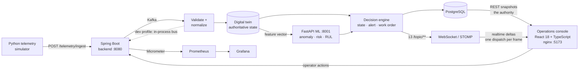

# ForgeSense — Industrial Intelligence & Operations Console

> An operations console for industrial asset health, anomaly detection, failure
> risk prediction, and maintenance recommendation, running end to end on
> synthetic telemetry.

ForgeSense turns a synthetic telemetry stream into a working industrial
operations console: a digital twin of the plant, live asset health, explainable
predictions, an alert lifecycle, a maintenance workflow, a what-if scenario
laboratory, and a platform observability surface.

> ### ⚠ This is a synthetic system
>
> All telemetry is generated by a simulator in this repository, and the ML
> models were trained on data that same simulator produced. **Nothing here
> monitors, represents, or controls any physical machine.** There is no OPC-UA,
> MQTT or fieldbus client in the codebase. "Inject scenario" means *change a
> synthetic generator's parameters*. The console states this in the sign-in
> gate, the status strip, and every workspace that could be misread.

---

## The problem

Industrial operations teams have real telemetry, and almost nothing they can
trust. Dashboards go stale without saying so. An "online" badge reflects a
connection, not a condition. A risk score arrives with no way to ask *why*. An
alert fires and then vanishes, because the next poll overwrote it. Nobody can
say, at 03:00, whether the screen in front of them is showing fresh data or a
frozen snapshot from four minutes ago.

The cost is not the data. It is the inability to distinguish **observed** from
**inferred**, **fresh** from **stale**, and **a model estimate** from
**a measurement**.

## The solution

ForgeSense is built around one idea: **the interface must tell you how much to
trust it.**

- Every meaningful number carries a **data basis** — observed, derived,
  model-predicted, synthetic, simulated, or unavailable.
- The connection indicator says `SYNTHETIC · simulator feed`, never `LIVE`,
  because a configured transport is not a healthy transport and a simulator is
  not a factory.
- Remaining-useful-life is shown in **simulator degradation steps** — never
  hours — because the backend contract defines no time unit. There is no
  hours formatter in the codebase, and a test enforces it.
- A `0.06%` failure risk renders as `0.06%`, never `0%`.
- Attribution is labelled **baseline perturbation**, never "SHAP", because no
  SHAP library is involved.
- When the ML service is down, predictions are labelled `HEURISTIC FALLBACK` and
  the Predictions banner says how many assets are affected.

Everything else follows from that discipline.

---

## Architecture


```mermaid
flowchart LR
    S[Python telemetry<br/>simulator] -->|POST /telemetry/ingest| B[Spring Boot<br/>backend :8080]
    B -->|Kafka| N[Validate +<br/>normalize]
    N --> T[(Digital twin<br/>authoritative state)]
    N -.dev profile: in-process bus.-> B
    T -->|feature vector| M[FastAPI ML :8001<br/>anomaly · risk · RUL]
    T --> D[Decision engine<br/>state · alert · work order]
    M --> D
    D --> P[(PostgreSQL)]
    D -->|13 /topic/**| W[WebSocket / STOMP]
    P -->|REST snapshots<br/>the authority| C
    W -->|realtime deltas<br/>one dispatch per frame| C[Operations console<br/>React 18 + TypeScript<br/>nginx :5173]
    C -->|operator actions| B
    B -->|Micrometer| PR[Prometheus] --> G[Grafana]
```

**The loop this demonstrates:** an operator injects a scenario → the simulator
emits different telemetry → the backend normalises and scores it → the ML service
produces an anomaly and a failure-risk estimate → the decision engine turns that
into machine state, alerts and maintenance recommendations → the console reflects
all of it within seconds, over the same WebSocket that carries the raw deltas.

| Layer | Technology |
| --- | --- |
| Frontend | React 18 · TypeScript 5.7 · Vite 6 · TanStack Query · Zustand · Three.js · ECharts |
| Backend | Java 25 · Spring Boot · Spring Security (JWT + RBAC) · WebSocket/STOMP |
| Data | PostgreSQL · Redis · Kafka (dev profile substitutes an in-process bus) |
| ML | Python · FastAPI · scikit-learn (IsolationForest + GradientBoosting) |
| Ops | Docker Compose · nginx · Prometheus · Grafana |

---

## Data flow

```
simulator → Kafka → validation → normalization → ML assessment → decision engine
                                                              ↓
                                            state change · alert · work order
                                                              ↓
                                    PostgreSQL (authority) + STOMP deltas
                                                              ↓
                     REST snapshot reconciliation ◀── console ◀── realtime deltas
```

**REST is the authority; realtime is a latency optimisation.** A sequence gap
or a reconnect triggers a REST re-seat, so the client can never drift away from
the system of record. See
[`docs/REALTIME_FRONTEND_CONTRACT.md`](docs/REALTIME_FRONTEND_CONTRACT.md).

---

## The console

| Workspace | Question it answers |
| --- | --- |
| **Command Center** | What is happening in the factory, right now? |
| **Factory Twin** | Where is it, spatially — and what does it depend on? |
| **Fleet** | Every asset, filterable and sortable. |
| **Telemetry** | What are the sensors actually reading, and how fresh? |
| **Predictions** | Why is the model worried, and how much should I trust it? |
| **Anomalies** | Which signals are outside the modelled envelope? |
| **Analytics** | Fleet distribution, risk ranking, operational counts. |
| **Alerts** | The full lifecycle, with the actions your role permits. |
| **Maintenance** | The work-order board, mirroring the backend contract exactly. |
| **Event Stream** | What happened, and when. |
| **Scenario Lab** | What would break if… — with no physical control, stated loudly. |
| **System** | What is broken, what still works, what can I trust. |

**Digital twin** — Three.js, on-demand rendering (a stationary scene costs no
GPU), with three encoding modes: status, predicted risk, and dependency
propagation. Every machine is also reachable from the asset list, the fleet
table and `Ctrl+K`, so the 3D view is an enhancement, never a gate.

**Differentiators** — a data-trust indicator on every view; an explainability
bridge from a prediction driver to the telemetry it came from; a
risk → alert → investigation → maintenance flow; selection shared across every
workspace; and a unified operational event timeline (`Event Stream`).

---

## Why this project is technically interesting

The individual pieces are common. The **integration under one honest
data contract** is the part worth reading.

**Realtime, isolated from render pressure.** An 18-asset feed at 5 s is ~3.6
events/second. Routing that through shared state would re-render the console
continuously. Instead the STOMP client coalesces per asset, dispatches **once per
animation frame**, keeps a **bounded 120-point ring only for assets someone is
watching**, and is read by exactly **3 components**. Measured: 0.16 s of script
time per 8 s wall (~2.7 % of one core), **zero** long tasks, 60 fps.

**REST as the authority, WebSocket as the latency.** Every envelope is
validated, deduplicated and sequence-checked before it reaches application
state; a gap triggers a REST re-seat rather than silent drift. If the socket
drops, the console gets *staler*, never *wrong*.

**One WebSocket, provably.** The client is a module singleton keyed by token,
mounted once above the router. Verified by instrumenting the `WebSocket`
constructor: **exactly 1** created across 14 route changes, closed on sign-out.

**Error isolation that survives a real failure.** Aborting `/maintenance` left
all 18 assets rendering with one panel in error. A failure is never rendered as
"no data" — "the server said there is nothing" and "the server did not answer"
stay distinguishable.

**A renderer that knows when to stop.** The Factory Twin renders on demand and
issues **0 WebGL draw calls** in an 8 s idle window. Render requests are gated on
comparable keys rather than material readbacks, because Three.js colour-manages
on `set` and a `getHex()` comparison always reports false change.

**Security headers that are actually served.** During hardening the declared
CSP, `X-Frame-Options` and `nosniff` were found **absent from every response** —
nginx does not inherit `add_header` into a `location` that declares one. The
config read as protected while shipping no policy at all. Fixed, and now
verified on the wire for `/`, deep links, hashed assets and `/healthz`.

**A defect class closed by a test.** Two separate "endpoint returned data the UI
showed as empty" bugs had the same root cause: a mis-guessed JSON envelope
silently becomes `[]`, which is indistinguishable from a legitimate empty
result. All collection reads now go through one shape-tolerant unwrapper, and a
second test asserts that **every `var(--token)` in `src/` is actually defined** —
which caught 33 stale colour references the hex-literal audit could not.

**Verification as part of the deliverable.** 86 unit tests, 43 browser tests,
strict TypeScript, and 60 responsive combinations. The suite has caught real
defects: a Command Center hero that broke the page-`h1` accessibility contract,
and an event list that was permanently empty.

This is a demonstration of **architecture and decision-pipeline design**. It is
not a production industrial deployment, and the limitations section says exactly
what that means.

---

## Run it

```bash
cp .env.example .env     # PowerShell: Copy-Item .env.example .env
# Set POSTGRES_PASSWORD and FORGESENSE_SECURITY_JWT_SECRET in .env.
docker compose up --build -d
```

| Service | URL |
| --- | --- |
| **Console** | http://localhost:5173 |
| Backend / OpenAPI | http://localhost:8080 · /swagger-ui/index.html |
| ML health | http://localhost:8001/health |
| Prometheus · Grafana | http://localhost:9090 · http://localhost:3000 |

Sign in with `admin` / `forgesense-dev`.

### Rebuilding the console after a source change

> **`http://localhost:5173` is served by the nginx container, not a Vite dev
> server.** A change to anything in `frontend/src` is invisible in the browser
> until the image is rebuilt and the container is recreated.

```bash
docker compose up -d --build --force-recreate frontend
```

`--force-recreate` is required. `docker compose build` followed by a plain
`docker compose up -d` can leave the **old container running against the new
image tag**, so the browser keeps serving the previous bundle and the change
looks like it did not work. This is the single most common false negative while
working on this project.

To develop against a live-reloading dev server instead, run it outside Docker
and point it at the API (see [`docs/OPERATIONS_RUNBOOK.md`](docs/OPERATIONS_RUNBOOK.md)).
Do not leave both a dev server and the container serving 5173 at once.

Do **not** use `docker system prune -a` or similar to "fix" a stale container.
It deletes volumes and can destroy the database; recreate the service instead.

---

## Technology stack

Only technologies actually present in this repository.

**Frontend** — React 18 · TypeScript 5.7 (strict, `noUncheckedIndexedAccess`) ·
Vite 6 · TanStack Query 5 (server state, one key per resource) · Zustand 5 (UI
state + a separate high-frequency telemetry store) · Three.js 0.169 (Factory
Twin) · ECharts 5.5 (Analytics) · Lucide (icons) · hand-rolled design system
(`frontend/src/design-system`)

**Backend** — Java 25 · Spring Boot (Web, Security, JPA, Data Redis, Kafka,
Actuator) · Spring Security JWT + three fixed roles · STOMP over WebSocket
(`/ws`, 13 `/topic/**` destinations) · JPA/Hibernate · Micrometer

**ML service** — Python · FastAPI · scikit-learn (`IsolationForest` for anomaly,
`GradientBoosting` for failure risk) · baseline-perturbation attribution

**Data & infrastructure** — PostgreSQL · Redis · Kafka (Compose profile; the dev
profile substitutes an in-process bus behind an identical interface) · Docker
Compose · nginx (serves the built bundle, SPA fallback, security headers) ·
Prometheus · Grafana

**Testing** — Vitest 2.1 (86 unit) · Playwright 1.49 (43 browser, functional +
visual) · `tsc --noEmit` under strict mode, tests included

---

## Verify it

```bash
cd frontend
npm ci
npm run typecheck   # strict TypeScript, including tests
npm test            # 86 unit tests
npm run e2e         # 43 Playwright browser tests
```

Latest verified results (re-run, not copied forward):

| Check | Result |
| --- | --- |
| `tsc --noEmit` (strict, includes tests) | **clean** |
| Vitest | **86 passed** (6 files) |
| Playwright | **43 passed** (30 functional + 13 visual) |
| `vite build` | **clean** |
| Docker build (`npm ci`, committed lockfile) | **clean** |
| Services healthy | **9 / 9** |
| Console errors | **0** across all 12 workspaces |
| Uncaught exceptions | **0** |
| Unexpected failed requests / 4xx / 5xx | **0** |
| Horizontal overflow | **0** across 60 breakpoint × workspace combinations |
| Routes verified | **12**, each by direct load, back and forward |
| Security headers | **5 / 5** on the wire, on every path |
| WebSocket connections | **exactly 1** across 14 route changes |
| Three.js idle draw calls | **0** in an 8 s idle window |

Browser tests assert, on every route: zero console errors, zero uncaught
exceptions, zero failed requests, zero unexpected 404s, and no horizontal
overflow at 375 / 768 / 1024 / 1440 / 1920. The console walk also fails on any
Content-Security-Policy violation, because the headers are genuinely enforced
rather than merely declared.

Two guard tests exist specifically to stop silent failures: one asserts every API
collection endpoint's real JSON envelope, and one asserts every `var(--token)`
in `src/` is actually defined — an undefined custom property is not an error, so
it would otherwise render as nothing.

---

## Demo walkthrough (3–5 minutes)

Full script with timings and troubleshooting:
[`docs/DEMO_RUNBOOK.md`](docs/DEMO_RUNBOOK.md).

```
Scenario Lab
    ↓  inject VIBRATION_SPIKE on M-104 (severity 0.9)
STOMP telemetry  (telemetry.updated over the single WebSocket)
    ↓
anomaly / risk change  (anomaly 0.0 → 0.9993, risk 0.0006 → 0.0585)
    ↓
NORMAL → CRITICAL      (health 99.9 → 65.9)
    ↓
alert + priority incident
    ↓
maintenance work order present
    ↓
Command Center recomputes the fleet verdict
```

**M-104 (Conveyor Drive Motor) was deliberately chosen** because it begins in a
healthy `NORMAL` state, so the before/after is unambiguous and reproducible.
**M-105 is already `CRITICAL` at rest** with alerts and a work order, so
injecting into it changes nothing visible. M-104 also **fully recovers** to
`NORMAL` after `POST /api/v1/simulation/control/M-104/clear`, so the demo can be
run repeatedly.

> **An honest note on what does *not* change.** Alert and maintenance *counts*
> stay at 36 and 18, because the decision engine has already raised a standing
> recommendation for every asset before the demo starts. The demonstrable change
> is the **state transition, the health drop, the anomaly saturation, the 97×
> risk increase, and the asset entering Priority incidents** — not a counter
> going up.

The short version:

1. **Sign in** — `admin` / `forgesense-dev`. Header shows the plant verdict
   (`DEGRADED`), `SYNTHETIC FEED`, `ML failure-risk-v2`, and transport state.
2. **Command Center** — the hero answers "how is the plant" in one word.
3. **Open M-104** — live telemetry, prediction in violet with model version,
   alerts, work orders, event history.
4. **Scenario Lab** — note that **Run what-if** (analysis only, changes nothing)
   and **Inject into live feed** (changes what the simulator emits) are separate.
5. **Inject `VIBRATION_SPIKE`** — the real `ScenarioType` enum value.
6. **Watch it propagate** — over ~30 s, the numbers above.
7. **Return to Command Center** — the asset is red and the verdict recomputes.
8. **System** — close on the synthetic-data boundary and the limitations.

---

## Screenshots

All images below were captured from the running system. None are mocked, staged
or edited. What each one proves:
[`docs/RELEASE_EVIDENCE.md`](docs/RELEASE_EVIDENCE.md).

### Command Center


*The verdict leads; provenance is disclosed separately; all 18 assets are
colour-coded by operational state.*

### Asset inspector — M-104 telemetry


*Live sensor values with correct physical units, sparklines, and a note that
declines to assert a normal range it cannot know.*

### Scenario Lab


*What-if analysis and live-feed injection are separate, separately labelled
actions.*

### Factory Twin


*The same authoritative state rendered spatially. Representative geometry, not
surveyed plant models.*

### Maintenance board


*The full record reaches the UI through the adapter — 18 work orders, matching
the sidebar badge.*

### Predictions


*Model output quarantined in violet, labelled with model version, RUL in
simulator steps.*

### Alert Center


*Severity is a colour; lifecycle is weight and treatment — never a second
competing colour.*

### Responsive — 375px


*40 breakpoint × workspace combinations captured; zero horizontal overflow.*

---

## Documentation

| Document | Contents |
| --- | --- |
| [Architecture](docs/ARCHITECTURE.md) | System topology, frontend architecture, realtime and performance strategy |
| [Data flow](docs/DATA_FLOW.md) | One complete scenario, end to end, with the provenance distinction |
| [Frontend architecture](docs/FRONTEND_ARCHITECTURE.md) | State split, realtime pipeline, twin performance model, security trade-offs |
| [API contract](docs/API_FRONTEND_CONTRACT.md) | Every endpoint, with verified units, enums and error semantics |
| [Contract matrix](docs/audit/API_CONTRACT_MATRIX.md) | Verified response envelope per endpoint, and the rule for adding one |
| [Realtime contract](docs/REALTIME_FRONTEND_CONTRACT.md) | Topics, envelope, validation, batching, failure matrix |
| [Design system](docs/DESIGN_SYSTEM.md) | Tokens, components, data-basis vocabulary |
| [UI/UX guide](docs/UI_UX_GUIDE.md) | Layout reasoning and interaction patterns |
| [Model & UI provenance](docs/MODEL_UI_PROVENANCE.md) | What each number is, and what it is not |
| [Demo runbook](docs/DEMO_RUNBOOK.md) | Verified 3–5 minute walkthrough with expected values |
| [Portfolio description](docs/PORTFOLIO_DESCRIPTION.md) | Short / resume / portfolio blurbs, with the claims deliberately avoided |
| [Viva guide](docs/VIVA_GUIDE.md) | Architecture, systems, ML, security, performance, limitations |
| [Release evidence](docs/RELEASE_EVIDENCE.md) | What each screenshot proves, and how to regenerate it |
| [Release checklist](docs/RELEASE_CHECKLIST.md) | The verification gate, with commands to re-run it |
| [Testing](docs/TESTING.md) | Test strategy, coverage, and what is not covered |
| [Runbook](docs/OPERATIONS_RUNBOOK.md) | Run, verify, troubleshoot |
| [Known limitations](docs/KNOWN_LIMITATIONS.md) | Stated plainly, including the uncomfortable ones |
| [Future scope](docs/FUTURE_SCOPE.md) | Extension points — implemented / partial / planned |
| [Redesign report](docs/audit/FINAL_FRONTEND_REDESIGN_REPORT.md) | The full before/after audit |
| [Release hardening report](docs/audit/FINAL_RELEASE_HARDENING_REPORT.md) | Contracts, realtime, performance, Docker, security verification |
| [Repository forensics](docs/audit/FINAL_REPOSITORY_FORENSICS.md) | Final keyword search, classified |
| [Release report](docs/audit/FINAL_RELEASE_REPORT.md) | Final release status and recommendation |

Superseded design documents are preserved in
[`docs/archive/`](docs/archive/README.md) as historical evidence. **Current code
and current tests take precedence over them.**

---

## Limitations

These are real, and the project is more credible for stating them than for
hiding them. Full detail at
[`docs/KNOWN_LIMITATIONS.md`](docs/KNOWN_LIMITATIONS.md).

**Scope of the data**
- The telemetry is **synthetic**, generated by the simulator in this repository.
  The ML models were trained on that same simulator, so they have **never seen
  real equipment**.
- **No physical machine control.** Nothing actuates a machine, executes real
  maintenance, or reports real production output. There is **no fieldbus client
  at all** — no OPC-UA, no MQTT, no Modbus. "Inject scenario" means *change a
  synthetic generator's parameters*.
- Twin geometry is **representative, not surveyed** plant models.

**Accuracy of the model output**
- **No accuracy guarantee against real equipment.** Failure risk is a bare
  probability with **no confidence interval**.
- All 18 assets currently report a failure risk of exactly `0.0006` (`0.060%`).
  This is **genuine `failure-risk-v2` output**: the same response carries 8+
  distinct anomaly scores and 2 distinct health scores, so nothing is being
  collapsed in transit, and the formatter renders `0.00065` → `0.065%`. The
  model **saturates near zero** for nominal assets. The values are preserved
  as-is and the UI explains the saturation — manufacturing spread would mean
  fabricating a safety-adjacent number.
- Remaining-useful-life is a **simulator-relative step count**, not a calibrated
  RUL. Production efficiency and downtime risk are **modelled**, not measured.
- Attribution is **baseline perturbation, not SHAP** — labelled accurately
  because no SHAP library is involved.

**Engineering scope**
- Maintenance is the backend's **five states**, not a full CMMS (no inventory,
  work-order history or vendor management).
- **No multi-tenancy and no SSO** — three fixed roles.
- **Single-node topology.** Kafka partitioning, WebSocket scale-out and
  time-series storage are documented future work, not implemented.
- `/analytics/health-trends` returns a **snapshot, not a time series**, despite
  the name — so the console renders a distribution rather than inventing a trend.
- **Not a safety system.** No SIL/PL rating, interlock, or fail-safe design.
- CI runs on **software rendering (SwiftShader)**, so real GPU frame rates for
  the Factory Twin cannot be measured in CI. The GPU-independent property —
  zero idle draw calls — is what is asserted.

---


## License

MIT — see [LICENSE](LICENSE).

**Karkala Shiva Reddy** — [GitHub](https://github.com/karkalashivareddy)
