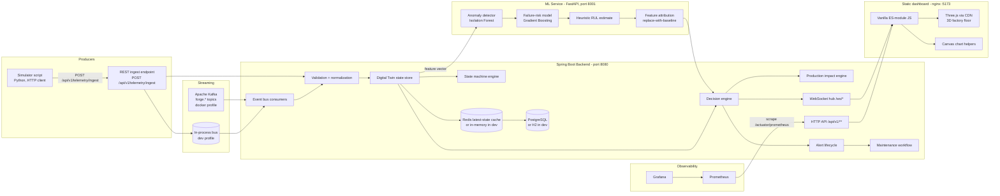

# ForgeSense — Architecture

## Key architectural positions

1. **An event-flow core with a WebSocket and REST surface.** Telemetry is
   ingested over HTTP, validated, normalized, and fed to the digital twin. The
   backend broadcasts events over WebSocket; the static frontend polls REST
   every 3 seconds and renders live state. The WebSocket endpoint exists and is
   used by server-side broadcast; the current frontend does not subscribe to it.

2. **Separation of "assess" from "decide".** The ML service answers *"what does
   the model assess for this telemetry?"* (`POST /assess`). The backend decision
   engine answers *"what should the system do about it?"* using configurable
   thresholds. Rules live in `application-*.yml` + service code, not inside ML.

3. **The digital twin is authoritative.** Every machine's synchronized state
   (telemetry, health, risk, status, dependencies, recent events) is owned by
   the backend. The 3D scene and all dashboards render from this one source of
   truth — the frontend never invents business state.

4. **Infrastructure adapters.** PostgreSQL/Redis/Kafka are the Compose-profile
   adapters; H2/in-memory/in-process bus are dev-profile adapters. Interfaces
   are identical, so behavior stays the same and the switch is environment-driven.

5. **Observability.** Micrometer counters/histograms/Timer, health indicators
   per dependency (DB, Redis, Kafka, ML), Prometheus export, Grafana dashboards.

## Component responsibilities

| Component | Responsibilities | Anti-responsibilities |
|---|---|---|
| Simulator | generate synthetic telemetry for the fleet, inject degradations, run bare mode | must not decide health/risk — that is upstream of it |
| Backend | domain truth: machines, state machine, alerts, maintenance, impact, simulation, websocket, API | must not train models |
| ML service | anomaly score, failure risk, heuristic RUL, feature attribution | must not own alert policy |
| Frontend | render synchronized state, interactions, what-if UX | must not compute business state |
| Redis | latest machine state / telemetry cache | not the source of truth |
| PostgreSQL | persisted domain + telemetry history | telemetry history bloat is a foreseeable analytics problem |

## Scaling notes (future work, not implemented)

- Kafka partitions by `machineId` key → ordered per machine, parallel across
  machines.
- Consumer groups scale pipeline stages.
- Telemetry history could move to a time-series store (TimescaleDB/ClickHouse)
  as it grows; PostgreSQL would keep domain/history summarized.
- WebSocket scale-out: topic prefix per backend node or broker; sticky sessions.
- ML inference is stateless and horizontally scalable behind a load balancer.

These are the intended growth path and are documented as forward-looking —
only the single-node Compose topology is implemented today.