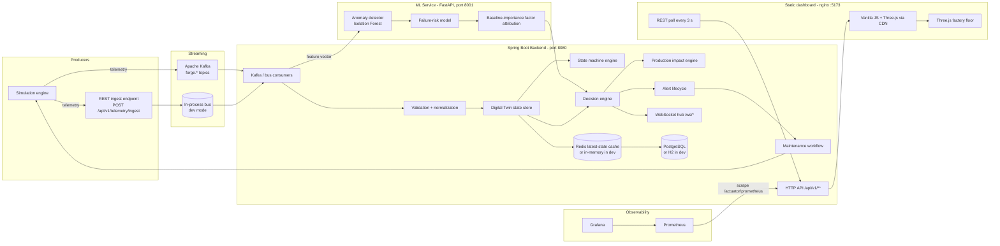

# ForgeSense — Architecture

## Key architectural positions

1. **A server-side event core with an honest polling browser.** Telemetry enters via
   `forge.telemetry.raw`, is normalized to `forge.telemetry.normalized`, and
   every downstream subsystem (digital twin, ML, alerts, timeline) consumes
   events. The frontend keeps itself updated by polling the REST API every 3 s;
   WebSocket push exists server-side (`/ws`) but the dashboard does not subscribe
   to it; the browser's verified transport is REST polling.

2. **Separation of "predict" from "decide".** The ML service answers
   *"what does the model predict?"* (`GET /health`, `POST /assess`). The backend
   decision engine answers *"what should the system do about it?"* using
   configurable rules. Rules live in `application-*.yml` + `SystemConfig`, not
   inside ML code.

3. **The digital twin is authoritative.** Every machine's synchronized state
   (telemetry, health, risk, status, dependencies, recent events) is owned by
   the backend. The 3D scene and all dashboard views render from this one source
   of truth — the frontend never invents business state.

4. **Infrastructure adapters.** PostgreSQL/Redis/Kafka are the production
   adapters; H2/in-memory/in-process bus are dev adapters. Interfaces are
   identical, so behavior is the same and the switch is environment-driven.

5. **Observability everywhere.** Micrometer counters/histograms, health
   indicators per dependency, Prometheus export, Grafana dashboards.

## Component responsibilities

| Component | Responsibilities | Anti-responsibilities |
|---|---|---|
| Simulator | generate plausible machine telemetry, run scenarios, expose control API | must not decide health/risk — that is upstream of it |
| Backend | domain truth: machines, state machine, alerts, maintenance, impact, simulation, websocket, API | must not train models |
| ML service | anomaly score, failure-risk, RUL estimate, baseline-importance factors | must not own alert policy |
| Frontend | render synchronized state, interactions | must not compute business state |
| Redis | latest telemetry / machine state cache, small short-lived state | not the source of truth |
| PostgreSQL | persisted domain + history | investors-free time-series bloat becomes analytics problem |

## Scaling (how this grows)

- Kafka partitions by `machineId` key → ordered per machine, parallel across
  machines.
- Consumer groups scale pipeline stages.
- Telemetry history moves to a time-series store (TimescaleDB/ClickHouse) as it
  grows; PostgreSQL keeps domain/history summarized.
- WebSocket scale-out: topic prefix per backend node or broker; sticky sessions.
- ML inference: stateless, horizontally scalable behind a load balancer with
  model warm cache.
- See `docs/SYSTEM_DESIGN.md:scalability`.
