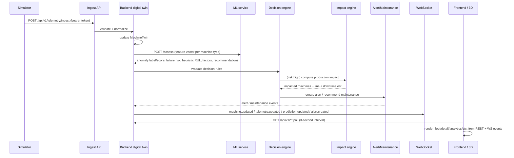

# ForgeSense — Data Flow

The data flow of the platform, end to end. Every UI element maps to one of
these steps.

## 1. The primary flow



## 2. Telemetry ingestion paths

ForgeSense supports two ingestion paths selected by configuration:

**Dev profile (default):**
```
Simulator → POST /api/v1/telemetry/ingest → in-process EventBus → validation → twin
```

**Docker/Compose profile:**
```
Simulator (external) → POST /api/v1/telemetry/ingest → Kafka raw topic → backend consumer → validation → twin
```

In both cases the ingest endpoint is HTTP. Kafka is used as the event backbone
inside the backend in the docker profile, not as a simulator transport.

## 3. Machine state change flow

1. Normalized telemetry updates `MachineTwin.latestTelemetry`.
2. ML assessment (or heuristic fallback) yields anomaly score + failure risk.
3. State-machine intent computed (`NORMAL → DEGRADED → WARNING → CRITICAL …`).
4. Valid transition applied by `MachineStateMachine` (or rejected).
5. On accepted change → `MACHINE_STATE_CHANGED` event + `machine.state.changed`
   WebSocket broadcast → 3D machine changes color/animation; panels update on
   the next poll.

## 4. Alert lifecycle

```
Telemetry signals anomaly/risk threshold
→ DecisionEngine creates Alert (NEW, CRITICAL/WARNING/etc.)
→ alert.created + timeline entry
→ Operator acknowledges (ACKNOWLEDGED)
→ Operator investigates (INVESTIGATING)
→ Maintenance created/scheduled
→ Alert resolved (RESOLVED) with resolution notes
→ alert.updated + timeline entries
```

## 5. Demonstration scenario (M-104)

The canonical story the system demonstrates end-to-end:

```
1. M-104 (Conveyor Drive Motor) starts NORMAL.
2. Degradation injected: vibration ↑, temperature ↑, RPM unstable.
3. Anomaly score climbs; failure risk climbs.
4. State WARNING → CRITICAL; CRITICAL alert created.
5. Feature attribution (top contributing factors) available in the inspector.
6. Impact engine: affected dependency machines, line throughput ↓, downtime estimate.
7. Operator runs what-if simulation (baseline vs scenario).
8. Maintenance scheduled → MAINTENANCE state → RECOVERING → NORMAL.
9. All numbers come from the simulator + pipeline; nothing hand-edited.
```

## 6. UI state sources

| UI element | Data source |
|---|---|
| KPIs | `GET /api/v1/analytics/overview` (polled) |
| 3D machines | `GET /api/v1/machines` + REST telemetry (polled); WS events when subscribed |
| Live telemetry strip | LAST telemetry payload from REST poll |
| Alerts panel | `GET /api/v1/alerts` + WS events |
| Inspector charts | REST `/api/v1/machines/{machineId}/telemetry?range=` (polled) |
| Explanation | `GET /api/v1/machines/{machineId}/predictions` (attribution factors) |
| Impact page | REST `/api/v1/impact/{machineId}` |
| Simulation | REST `/api/v1/simulation/scenarios` + `/run` |
| Timeline | REST `/api/v1/events?machineId=` |

The current frontend polls REST every 3 seconds (`state.js`). WebSocket updates
are broadcast server-side; frontend subscription is a planned enhancement.

## 7. Backpressure / staleness rules

- Normalization rejects timestamps older than `forgesense.telemetry.maxStaleness`
  (default 60s) to avoid replay flooding the twin.
- Out-of-range physical values are rejected or clamped by the normalizer.
- If telemetry for a machine stops for > `forgesense.machine.offlineAfter`
  (default 30s), the twin marks connectivity `STALE/OFFLINE`.
- Per-machine ordering preserved; cross-machine order is not assumed.