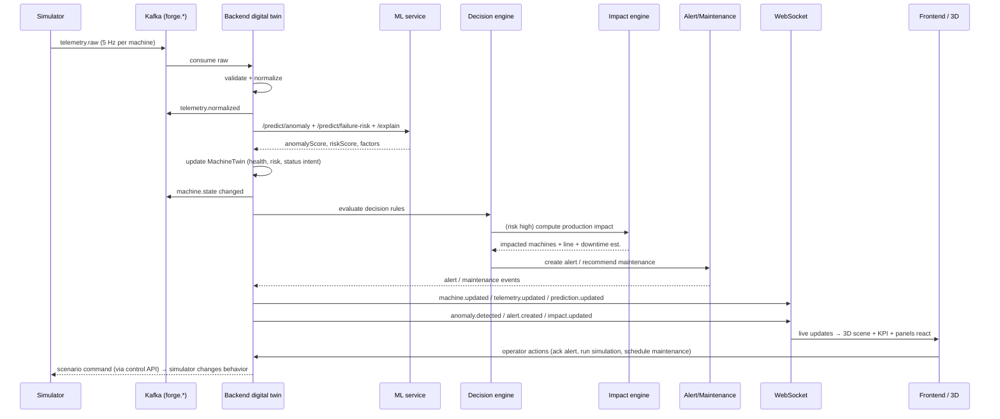

# ForgeSense — Data Flow

The central data flow of the platform, described end-to-end. This is the
"heart of the project" — every UI element maps to one of these steps.

## 1. The primary flow



## 2. Telemetry ingestion paths

ForgeSense supports two equivalent production paths selected by configuration:

**Path A — Kafka-first (docker profile):**
```
Simulator → (kafka-python producer) → forge.telemetry.raw → backend consumer
```

**Path B — HTTP-first (dev profile):**
```
Simulator → POST /api/v1/telemetry/ingest → in-process EventBus → same consumer
```

Both paths land in the identical normalization/twin/ML pipeline. The UI shows,
per source, `LIVE (Kafka)` or `LIVE (HTTP/embedded)` — never a false badge.

## 3. Machine state change flow

1. Normalized telemetry updates `MachineTwin.latestTelemetry`.
2. `HealthScore` recomputed from anomaly/risk/threshold model.
3. State-machine intent computed (`NORMAL → DEGRADED → WARNING → CRITICAL …`).
4. Valid transition applied by `MachineStateMachine` (or rejected).
5. On accepted change → `MACHINE_STATE_CHANGED` event + `machine.state.changed`
   WebSocket message → 3D machine changes color/animation + panels update.

## 4. Alert lifecycle

```
Telemetry signals anomaly/risk threshold
→ DecisionEngine creates Alert (NEW, CRITICAL/WARNING/etc.)
→ alert.created + timeline entry
→ Operator acknowledges (ACKNOWLEDGED)
→ Operator investigates (INVESTIGATING)
→ Maintenance created/scheduled
→ Alert resolved (RESOLVED) with resolution notes
→ alert.updated + timeline entries
```

## 5. Demonstration scenario (M-104)

The canonical story the product demonstrates end-to-end:

```
1. M-104 (Conveyor Drive Motor) starts NORMAL.
2. Degradation injected: vibration ↑, temperature ↑, RPM unstable.
3. Anomaly score climbs; failure risk climbs.
4. State WARNING → CRITICAL; CRITICAL alert created.
5. AI explanation (SHAP factors) available in the inspector.
6. Impact engine: M-106 waits, Assembly line throughput ↓, downtime estimate.
7. Operator runs what-if simulation (baseline vs scenario).
8. Maintenance scheduled → MAINTENANCE state → RECOVERING → NORMAL.
9. Materials fully driven by the simulator + pipeline; nothing hand-edited.
```

## 6. UI state sources

| UI element | Data source |
|---|---|
| KPIs | `/api/v1/analytics/overview` + live WS counters |
| 3D machines | `machine.updated` / `machine.state.changed` (twin) |
| Live telemetry strip | `telemetry.updated` |
| Alerts panel | `alert.created` / `alert.updated` + REST initial load |
| Inspector charts | REST `/telemetry?range=` (downsampled) + WS updates |
| Explanation | REST `/predictions/{id}/explain` or `GET /machines/{id}/explanation` |
| Impact page | REST `/impact/{machineId}` |
| Simulation | REST `/simulation/scenarios` + `/simulation/run` |
| Timeline | REST `/events?machineId=` + WS events |

## 7. Backpressure / staleness rules

- Normalization rejects timestamps older than `forgesense.telemetry.maxStaleness`
  (default 60s) to avoid replay flooding the twin.
- Duplicate `eventId`s are dropped (recently-seen set).
- If telemetry for a machine stops for > `forgesense.machine.offlineAfter`
  (default 30s), the twin marks connectivity `STALE/OFFLINE`.
- Per-machine ordering preserved (keyed by machineId); cross-machine order is
  not assumed.