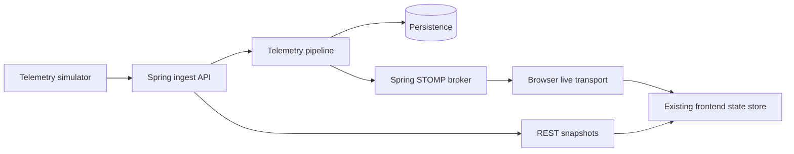

# ForgeSense real-time architecture

ForgeSense uses two complementary transport paths:

## Browser behavior

- The browser connects to the Spring WebSocket endpoint at `/ws` and sends a STOMP `CONNECT` frame. The endpoint also keeps SockJS transports available for clients that need them.
- It subscribes to the backend’s canonical topics: `telemetry.updated`, `machine.updated`, `machine.state.changed`, `prediction.updated`, `alert.*`, `maintenance.*`, `simulation.updated`, `events.updated`, and `impact.updated`.
- Messages are JSON-validated at the transport boundary and coalesced by topic plus machine ID for one animation frame. The queue is bounded at 240 pending deltas.
- A reconnect uses exponential backoff up to 30 seconds. Closing a route or reloading the page does not leave timers or sockets behind.
- REST polling remains enabled every three seconds as the authoritative snapshot and fallback when the broker is unavailable. The header exposes `LIVE · STOMP` or `REST FALLBACK` so the operator can distinguish freshness from transport health.

## Consistency rule

Live events update only fields present in the backend payload. The next REST snapshot reconciles the complete fleet, alerts, events, analytics, and maintenance state after reconnect or a missed message. The frontend never fabricates machine status or prediction values.

## Extension point

The browser adapter is isolated in `frontend/js/realtime.js`. A future MQTT, OPC-UA, or edge-gateway adapter belongs behind the backend ingestion boundary; it should not be added directly to the UI.
