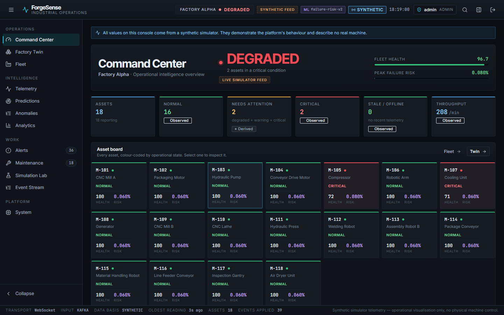
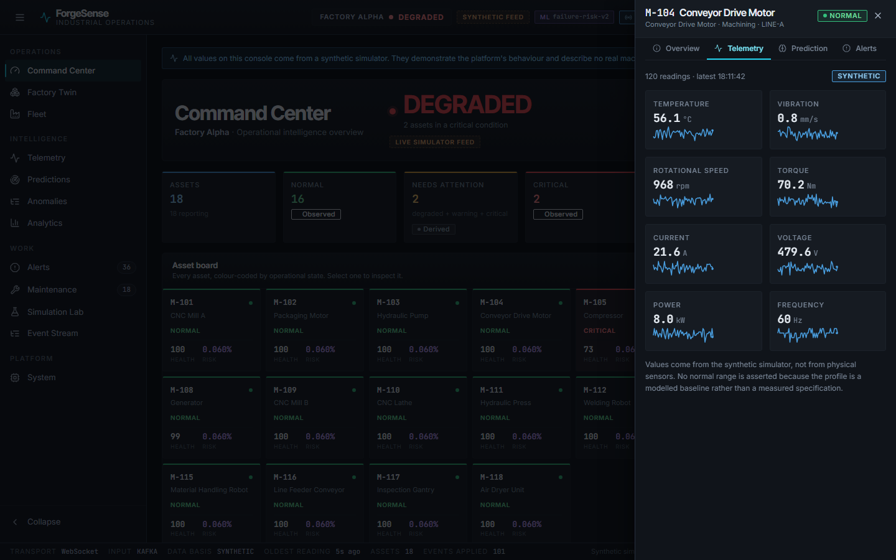
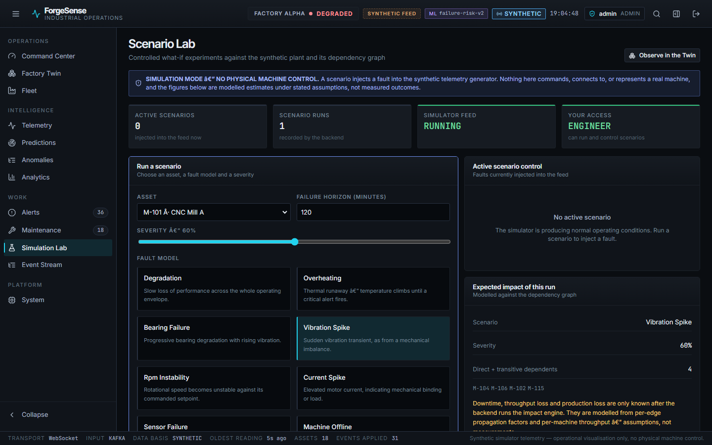
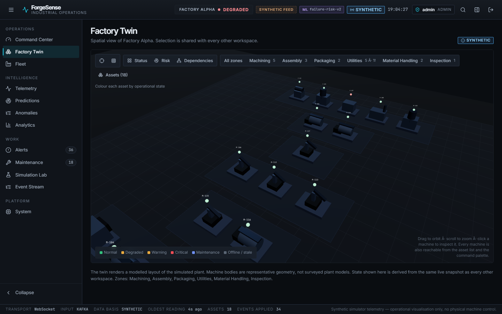
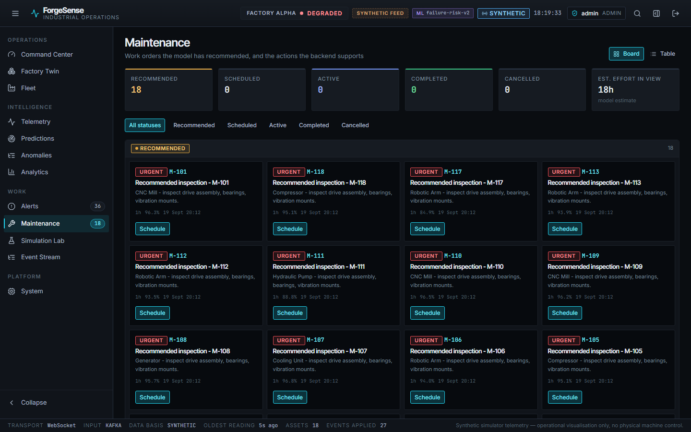
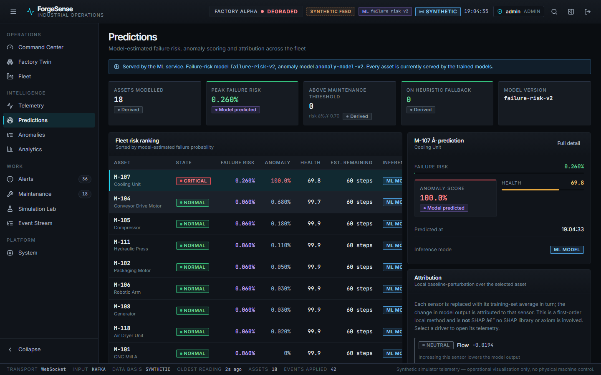
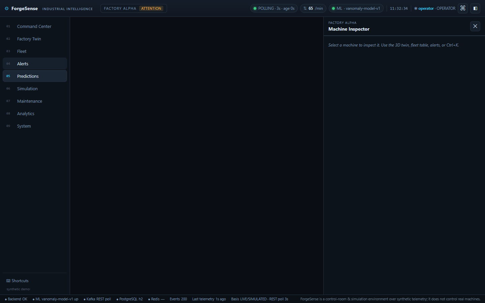
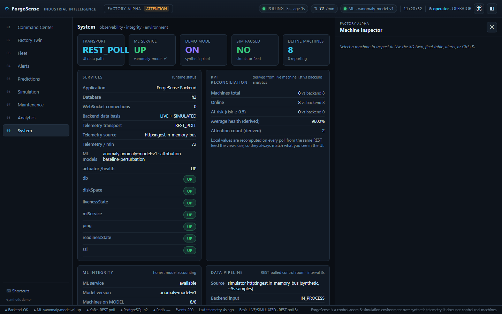
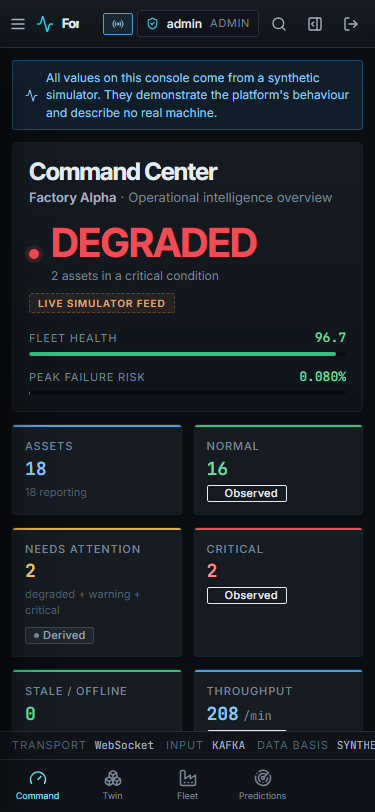

# ForgeSense — Release evidence plan

Screenshots and artefacts that substantiate the release claims. **Every image in
[`screenshots/`](screenshots/) was captured from the running system** — none are
mocked, staged, or hand-edited. Live figures quoted below were read from the API
during the capture.

## How to regenerate

Reuse the repository's existing tooling rather than new scripts:

```bash
# Responsive + overflow sweep, 8 workspaces x 5 breakpoints = 40 images
cd frontend
CAPTURE_SCREENSHOTS=true E2E_BASE_URL=http://localhost:5173 npx playwright test \
  e2e/visual.spec.ts --project=visual -g "no horizontal overflow"
# writes to frontend/test-results/visual/<workspace>-<width>.png
```

Note: `test-results/` is git-ignored. Promote selected images into
`docs/screenshots/` deliberately, and refresh them whenever the UI changes so
this document never drifts from reality.

---

## Evidence 1 — Command Center



**File:** `screenshots/01-command-center.png` · 1440×900

**Proves:** the console answers "is this plant okay, and what needs me?" in one
screen; operational state and data provenance are visually distinct; the asset
board renders all 18 assets with per-asset state, health and risk.

**Must be visible:**

| Element | Why it matters |
|---|---|
| `h1` = "Command Center" | the workspace names itself; not the plant |
| `DEGRADED` verdict, largest type | the answer to question 1 leads the page |
| `SYNTHETIC FEED` **and** `LIVE SIMULATOR FEED` chips | provenance is disclosed, not inferred |
| `ML failure-risk-v2` | which model produced the violet numbers |
| Fleet health / peak failure risk meters | quantitative backing for the verdict |
| 6 KPI tiles with `Observed` / `Derived` basis chips | provenance per tile, not once per page |
| Asset board, 18 cards, M-105 + M-107 red | colour = operational state |
| Sidebar badges: Alerts 36, Maintenance 18 | live counts match the panels |
| Status strip: `TRANSPORT WebSocket`, `INPUT Kafka`, `DATA BASIS SYNTHETIC`, `OLDEST READING` | transport and freshness are proven, not asserted |
| Footer disclaimer | synthetic-data boundary on every screen |

**Data source:** `GET /api/v1/machines` (3 s) + `GET /api/v1/analytics/overview`
(15 s).

**Provenance:** Assets/health = **OBSERVED** · NORMAL/CRITICAL counts = **DERIVED**
· failure risk = **PREDICTED** (violet) · whole feed = **SYNTHETIC**.

**Observed at capture:** 18 assets, 16 `NORMAL`, 2 `CRITICAL` (M-105, M-107),
fleet health 96.7, peak risk 0.080%, `DEGRADED` — "2 assets in a critical
condition".

> **Honest caveat to state when presenting this image:** all nominal assets read
> `0.060%` risk because `failure-risk-v2` saturates near zero for healthy
> assets. This is genuine model output, investigated and documented in
> [`DATA_FLOW.md`](DATA_FLOW.md) §5 — not a rendering artefact and not
> suppressed.

---

## Evidence 2 — Asset Inspector



**File:** `screenshots/03-machine-inspector-telemetry.png` · 1440×900

**Proves:** per-asset drill-down with live telemetry, correct physical units, and
a provenance note that refuses to assert a normal range it cannot know.

**Must be visible:** asset identity (`M-104 Conveyor Drive Motor`), zone and line,
`NORMAL` badge, 5-tab inspector, `120 readings · latest <time>`, `SYNTHETIC`
badge, 8 sensor metrics each with a sparkline, and the note *"Values come from
the synthetic simulator, not from physical sensors. No normal range is asserted
because the profile is a modelled baseline rather than a measured
specification."*

Companion captures: `03b-inspector-prediction.png` (violet model output),
`03b-inspector-explanation.png` (attribution factors).

**Data source:** `GET /api/v1/machines/{id}/telemetry?limit=120` + live
`telemetry.updated` deltas.

**Provenance:** sensors = **OBSERVED** (synthetic in content) · risk/anomaly =
**PREDICTED** · operating state = **DERIVED**.

**Observed at capture:** temperature 56.1 °C, vibration 0.8 mm/s, 968 rpm,
70.2 Nm, 21.6 A, 479.6 V, 8.0 kW, 60 Hz.

---

## Evidence 3 — Scenario Lab



**File:** `screenshots/06-simulation.png` · 1440×900

**Proves:** the simulation boundary is explicit. **Run what-if** (analysis only,
changes nothing) and **Inject into live feed** (changes what the simulator
emits) are separate, separately labelled actions.

**Must be visible:** the two action groups, the `ScenarioType` picker
(`VIBRATION_SPIKE` is the real enum value), severity control, active-control
table, and the run history.

**Data source:** `GET /api/v1/simulation/scenarios`,
`GET /api/v1/simulation/control`; `POST /api/v1/simulation/run` (what-if) and
`POST /api/v1/simulation/control` (inject).

**Provenance:** **SIMULATED** (what-if) and **SYNTHETIC** (injected feed
parameter).

---

## Evidence 4 — Factory Twin



**File:** `screenshots/08-factory-3d.png` · 1440×900

**Proves:** the same authoritative state rendered spatially; mode switching
(Status / Risk / Dependencies); zone filtering; selection shared with every
other workspace; representative geometry is labelled as such.

**Must be visible:** mode toggle, zone chips with counts, `Assets (18)`,
legend, the caption *"Machine bodies are representative geometry, not surveyed
plant models"*, and the `SYNTHETIC` badge.

**Data source:** `GET /api/v1/machines` + `GET /api/v1/zones` +
`GET /api/v1/machines/dependencies/edge`.

**Provenance:** state = **DERIVED** from OBSERVED; Risk mode = **PREDICTED**.

**Rendering evidence:** 0 WebGL draw calls in an 8 s idle window (measured by
wrapping `drawElements`/`drawArrays`), and no growth in DOM nodes or listeners
across repeated Twin visits.

---

## Evidence 5 — Maintenance Board



**File:** `screenshots/10-maintenance-board.png` · 1440×900

**Proves:** the full record reaches the UI through the adapter — the exact class
of bug that previously rendered this page empty. 18 `RECOMMENDED` work orders
must be visible, matching the sidebar badge.

**Must be visible:** 5 stage metrics (only populated stages get a lane; counts
for all 5 stay in the metric row), the work-order cards with priority, asset,
title, duration, risk-at-creation and timestamp, the `Schedule` action, and the
note that empty stages are collapsed.

**Data source:** `GET /api/v1/maintenance?limit=100` → `normaliseMaintenance` →
`{items, total}` envelope.

**Cross-check (this is the regression guard):**

| Consumer | Expected |
|---|---|
| Sidebar badge | 18 |
| Stage metric `RECOMMENDED` | 18 |
| Board cards | 18 |
| Table view rows | 18 |
| Command Center backlog panel | 18 |
| Machine inspector work-order tab | present for the selected asset |

**Provenance:** duration = **model estimate** (labelled "Est. effort in view /
model estimate") · risk at creation = **PREDICTED** · the work order itself =
**DERIVED** by the decision engine.

---

## Evidence 6 — Predictions / risk visualisation



**File:** `screenshots/05-predictions.png` · 1440×900

**Proves:** model output is visually quarantined in violet, labelled with model
version, and never presented as certainty.

**Must be visible:** the model banner (versions + heuristic-fallback count), the
`Predicted` basis chips, per-asset risk/anomaly/RUL rows, and units — RUL
explicitly in `steps`, never converted to hours.

Companion: `04-analytics.png` (health distribution, risk ranking).

**Data source:** `GET /api/v1/machines/{id}/predictions`,
`GET /api/v1/analytics/risk-ranking`, `GET /api/v1/machines/{id}/explanation`.

**Provenance:** **PREDICTED**. This is the workspace where a reader must never
mistake output for measurement.

---

## Evidence 7 — Alert Center



**File:** `screenshots/07-alerts.png` · 1440×900

**Proves:** severity and lifecycle are orthogonal axes — severity is a colour,
lifecycle is weight and treatment, never a second competing colour.

**Data source:** `GET /api/v1/alerts?status=&limit=100`.

---

## Evidence 8 — System / boundary



**File:** `screenshots/09-system.png` · 1440×900

**Proves:** the honesty boundary is inspectable, not just asserted. Transport,
input mode, data basis, ML availability and model versions, plus per-dependency
health.

**Must be visible:** `DATA BASIS SYNTHETIC`, `TRANSPORT`, `INPUT`, ML model
versions, and the component health list.

---

## Evidence 9 — Responsive



**File:** `screenshots/10-command-center-375.png` · 375×812

**Proves:** the console is usable on a phone, not merely non-overflowing.
Captured by the same test that asserts zero horizontal overflow.

**Coverage:** 5 breakpoints (375 / 768 / 1024 / 1440 / 1920) × 8 workspaces
= **40 combinations, zero overflow**, asserted in CI.

---

## Non-image evidence

| Claim | Artefact |
|---|---|
| Envelope per endpoint | [`audit/API_CONTRACT_MATRIX.md`](audit/API_CONTRACT_MATRIX.md) |
| Test/build/security/performance results | [`audit/FINAL_RELEASE_HARDENING_REPORT.md`](audit/FINAL_RELEASE_HARDENING_REPORT.md) |
| Repository-wide search results | [`audit/FINAL_REPOSITORY_FORENSICS.md`](audit/FINAL_REPOSITORY_FORENSICS.md) |
| Release gate results | [`audit/FINAL_RELEASE_REPORT.md`](audit/FINAL_RELEASE_REPORT.md) |
| Verified demo script | [`DEMO_RUNBOOK.md`](DEMO_RUNBOOK.md) |

## Rules for maintainers

1. **Never stage a screenshot to look better.** If a number looks unflattering
   (the `0.060%` saturation, the flat health distribution), show it and explain
   it. A curated-looking demo that hides a limitation is worse than no demo.
2. **Never edit an image.** Re-capture instead.
3. **Re-capture after any UI change** so this document cannot drift.
4. **Keep the synthetic disclaimer in frame** wherever the content could be
   mistaken for a real plant.
